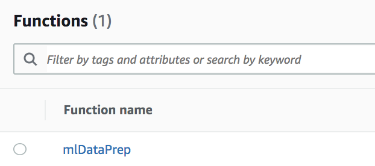
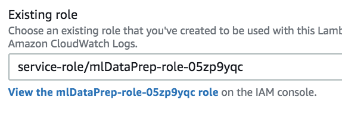
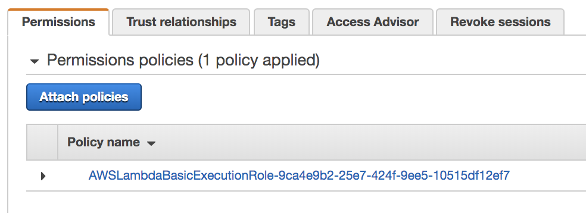
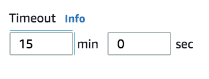
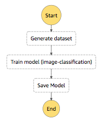
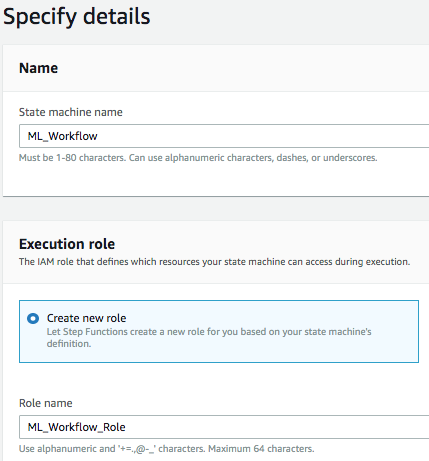
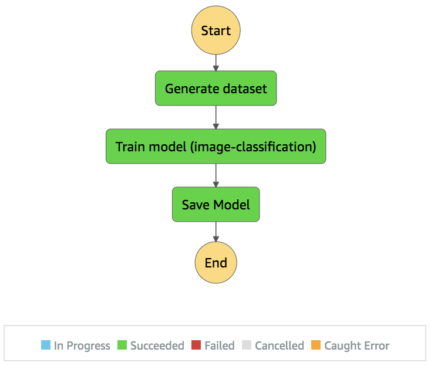

# ML Workflow

## The workflow problem

Once you have finished coding your ML code, it might be necessary to retrain the model from time to time, as new data becomes available. So, we will create an automated workflow for this task.

## SageMaker Workflows

Now we will create an ML Workflow to retrain the model.

SageMaker has integration with some orchestration tools such as AWS Step Functions and Apache Airflow.
In this workshop, we will use Step Functions to prepare, train, and deploy our machine learning model.

The workflow steps will look like the figure below:

- Generate Dataset: Invokes a lambda function responsible for reading the folder and file structure in S3 and generating a TSV file containing some metadata.
- Train Model: Creates and runs a training job in SageMaker.
- Save Model: Saves the model for later use.

## Dataprep using Amazon Lambda

Before we can create our workflow, we need to create the Lambda function responsible for generating the metadata files.

Go to the Lambda console and create a new function from scratch, as follows:

Once you have created your function, click on it:

Search for the role created for the lambda function, and click "View the mlDataPrep-role-xyz role"

Click "Attach Policies", select the AmazonS3FullAccess policy, and click "Attach Policy".

Now return to your Lambda function. Change the Timeout to 15 minutes:

The last step to finalize our function is to modify the source code. Download the source code [here](https://raw.githubusercontent.com/gabrielmartinigit/melissa_workshop/master/workflow/code/generate_lst_lambda_template.py) and paste it into the "Function Code" field.
Now follow the instructions in the source code and modify the name of the buckets. Then save and test the function.
Check the function output logs. If it worked correctly, you will see the following message:

## Workflow definition using AWS Step Functions

Now that you have your Lambda function ready, you can create your Worklow.
Go to the step functions console and create a new State Machine by clicking on "State Machines" / "Create state machine".
Download the workflow definition file [here](https://raw.githubusercontent.com/gabrielmartinigit/melissa_workshop/master/workflow/code/model_workflow_template.json) and paste the contents into the "Definition" field.
Click the "refresh" button in the picture to see the graphical representation of your workflow. It should look like the following image:

Now click "Next", fill out the fields as the image below and click "Create state machine".

Congratulations! You have created your first Machine Learning Workflow. To test it, click "Start execution".
The workflow should take about 10 minutes to complete. If everything works, at the end you will see the following image, with all the green steps:

